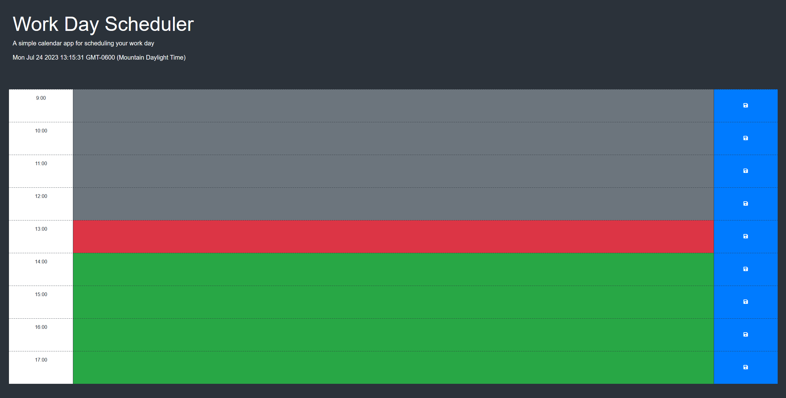

# work-day-scheduler
A simple calendar application that allows a user to save events for each hour of a typical working day (9am–5pm).

## Description
A simple calender / work day scheduler that dynamically updates each time block to display if it is the current hour or if it is in the past / future within a standard working time frame of 9AM to 5PM (listed in 24 hour format in this instance, 9-17). The user can enter content into specific time blocks and save them to the browsers localStorage for local data persistence.

## Installation

NA

## Usage

The end result can be viewed [here.](https://jaredboehm.github.io/work-day-scheduler/)

## License

NA